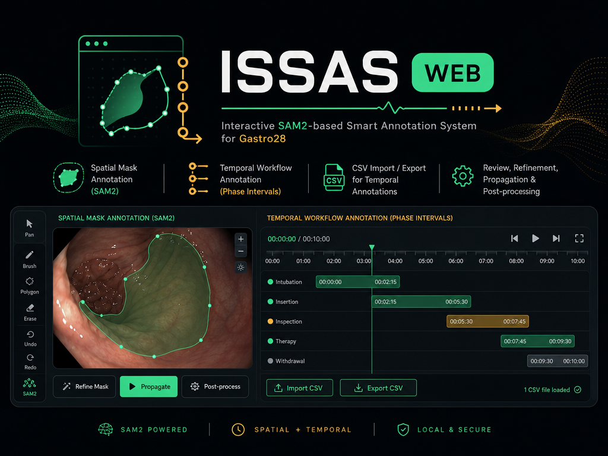
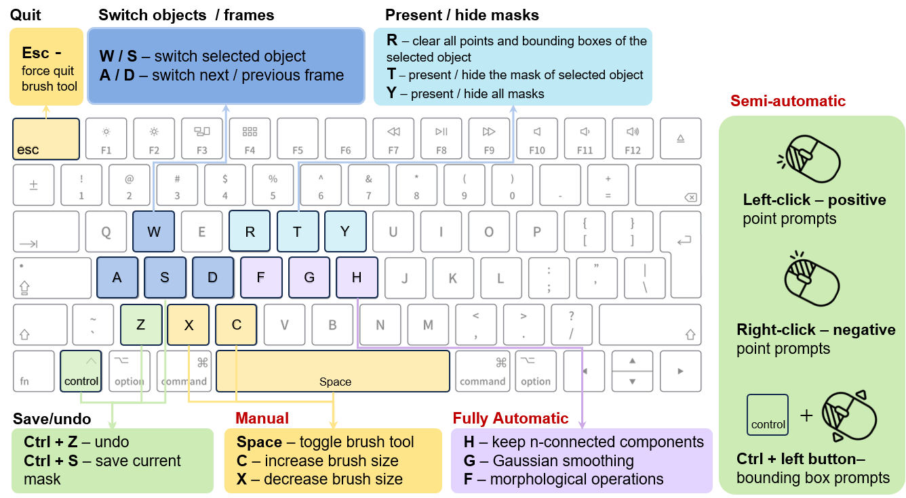

# Interactive SAM2-based Smart Annotation System (ISSAS) Web

  

ISSAS Web is the browser-based version of the **Interactive SAM2-based Smart
Annotation System (ISSAS)** for [Gastro28](https://github.com/mqxwd68/ISSAS). It contains:

- a spatial mask annotation interface powered by SAM2;
- a temporal workflow annotation interface for phase intervals;
- CSV import/export for temporal annotations;
- local review, mask refinement, propagation, and post-processing tools.

The application runs locally. Images, videos, annotations, and model checkpoints
are not uploaded to an external server.

## Supported systems

- macOS on Apple Silicon (MacBook Pro M3/M4);
- Ubuntu Linux;
- Windows through WSL2 with Ubuntu.

For spatial SAM2 annotation, an NVIDIA GPU on Ubuntu/WSL gives the best performance.
On Apple Silicon, the backend selects PyTorch MPS when it is available. If SAM2
cannot load, ISSAS Web starts in simulation mode so the interface can still be
tested. The temporal workflow tool does not require SAM2.

## Fresh installation

### 1. Create the SAM2 environment

Install Conda or Miniforge, then run:

~~~bash
conda create -n sam2 python=3.11 -y
conda activate sam2
~~~

### 2. Install SAM2

~~~bash
git clone https://github.com/facebookresearch/sam2.git
cd sam2
python -m pip install -e .
~~~

Download the SAM2.1 checkpoints:

~~~bash
cd checkpoints
bash download_ckpts.sh
cd ..
~~~

See the [official SAM2 repository](https://github.com/facebookresearch/sam2) if
PyTorch needs a platform-specific installation.

### 3. Clone ISSAS Web inside SAM2

The final folder layout should be:

~~~text
sam2/
|-- checkpoints/
|-- sam2/
|-- ISSAS_Web/
~~~

From the SAM2 root folder:

~~~bash
git clone https://github.com/mqxwd68/ISSAS_Web.git
cd ISSAS_Web
python -m pip install -r requirements-web.txt
~~~

Already have the old ISSAS SAM2 environment? Follow
[UPDATE_EXISTING_SAM2_ENV.md](UPDATE_EXISTING_SAM2_ENV.md) instead.

## Run ISSAS Web

From `sam2/ISSAS_Web`:

~~~bash
conda activate sam2
export SAM2_CHECKPOINT=../checkpoints/sam2.1_hiera_large.pt
python server.py
~~~

Open these local addresses in a current browser:

- Spatial annotation: <http://127.0.0.1:9010>
- Temporal workflow annotation: <http://127.0.0.1:9010/workflow>

Keep the terminal open while using the application. Stop the server with
`Ctrl+C`.

## Temporal annotator without installation

`static/ISSAS-workflow.html` is self-contained. It can be opened directly in a
current Chrome, Edge, or Safari browser without Conda, Python, or SAM2. Select a
working folder or add videos, annotate phase intervals, then export the CSV file.

Browser security requires the annotator to confirm access when a local folder is
selected. The annotation draft remains in that browser's local storage.

## Basic spatial workflow

1. Open a folder containing ordered `.jpg`, `.jpeg`, `.png`, or `.tiff`
   frames.
2. Add an object and select its class.
3. Add positive/negative points or draw a bounding box.
4. Refine or propagate the mask through the frame sequence.
5. Save the masks and YOLO annotations to a local output folder.

### Context video while annotating

Open the **Files** drawer and set **Context video** to the folder containing the
source videos. Windows drive paths such as
`E:\Dataset\Gastrectomy_videos\002_S8a_videos_480p` are accepted when the server
runs in WSL. A frame folder for case `S01` is matched to `S01.mp4`.

ISSAS reads the video FPS automatically with `ffprobe`; enter an FPS value only
when it must be overridden. Hover over the frame progress bar to see the source
video timestamp, right-click a point on the bar to play its context, or use the
play button for the current frame. Playback is limited to 10 seconds before and
after that frame and can be shown as a floating, split, or main view.

Users can interactively perform annotation following the guidance shown below, which includes three modes of operation: fully automatic, semi-automatic, and manual.

## Basic temporal workflow

1. Open a folder containing the surgical videos.
2. Select a video and phase class.
3. Mark or drag the START and END anchors.
4. Add the interval and optional notes.
5. Export `<video_id>.csv`; import it later for review or modification.

## Notes

- The server is local and single-user; do not expose port 9010 to the internet.
- Model checkpoints are not stored in this repository. Keep them in the parent
  SAM2 `checkpoints/` folder.
- Do not commit clinical videos, frames, masks, exported results, or patient data.
- Windows users should run all commands inside WSL Ubuntu, not Windows PowerShell.

## Related project

The original desktop version is available at
[mqxwd68/ISSAS](https://github.com/mqxwd68/ISSAS).
